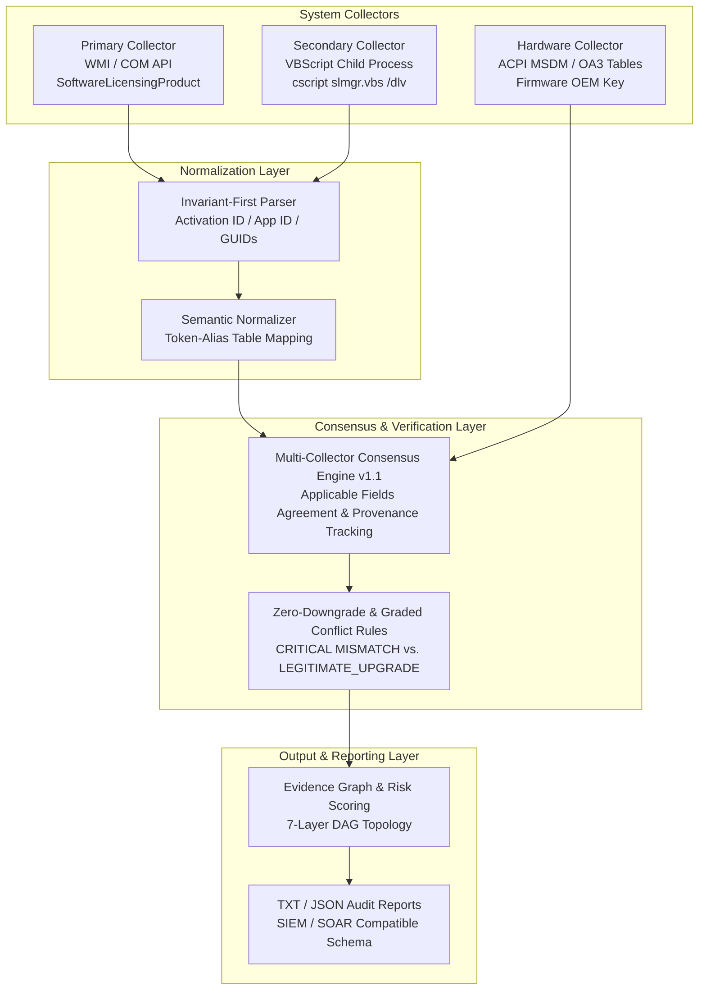
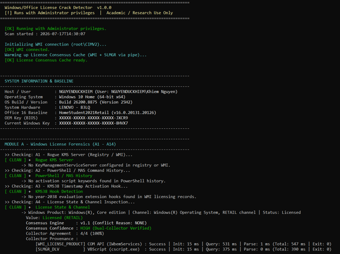
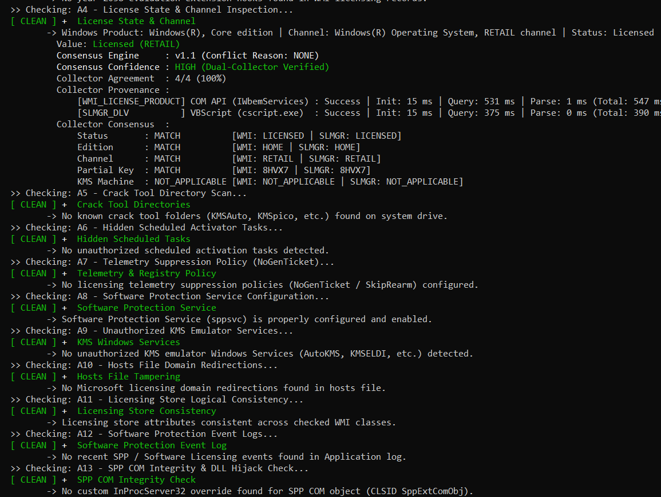
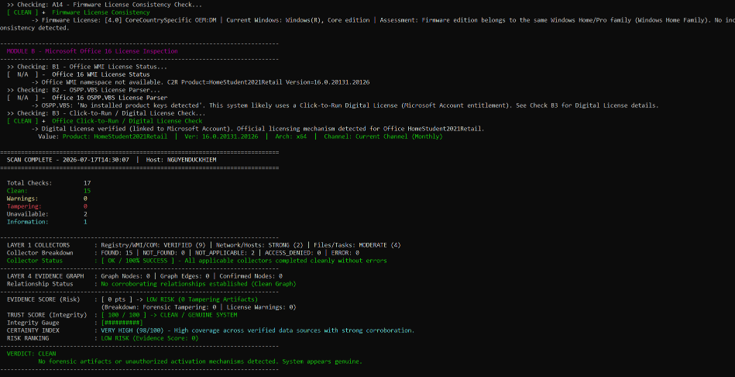

# License Integrity Scanner (License Inspector)

[](https://www.microsoft.com/windows)
[](https://en.cppreference.com/w/cpp/17)
[](https://cmake.org/)
[](#)

License Inspector is a lightweight, read-only system integrity scanner written in C++17. It performs systematic inspections across Windows 10/11 and Microsoft Office 2016/2019/2021/365 to detect unauthorized licensing modifications, activation bypass scripts, local KMS emulator services, and Click-to-Run (C2R) anomalies.

## 1. Scope & Capabilities (What the Tool Does and Does Not Do)

### What the Tool Does
- **Systematic Forensic Triage**: Executes 17 read-only checks across Windows OS (`[A1 - A14]`) and Microsoft Office (`[B1 - B3]`).
- **Cross-Validation Consensus**: Compares primary kernel/COM licensing states against secondary VBScript output (`slmgr /dlv`) to identify discrepancies.
- **Hardware Consistency Verification**: Reads ACPI `MSDM` and `OA3` tables via WMI to compare factory-shipped OEM digital keys against active operating system editions.
- **Structured Audit Reporting**: Exports human-readable (`.txt`) and machine-parseable (`.json`) audit reports with full collector breakdown metrics and raw audit trails.

### What the Tool Does NOT Do
- **No Automatic Remediation or Deletion**: The tool operates in read-only inspection mode. It does not delete files, terminate running services, or modify registry keys automatically.
- **No Support for Legacy Operating Systems**: Designed exclusively for 64-bit Windows 10 and Windows 11 (`x64`). Windows 7, Windows 8.1, and ARM64 architectures are not supported.
- **No External Dependency Resolution**: Relies entirely on built-in Windows APIs (WMI, COM, Win32 API). If the local WMI repository (`winmgmt` service) is corrupted or disabled, affected checks report `UNAVAILABLE (N/A)`.

## 2. System Architecture & Consensus Pipeline

### 2.1 High-Level Architecture Diagram


### 2.2 Multi-Collector Cross-Validation 
1. **Collector Independence & Provenance Tracking**:
   - Primary WMI (`WMI_LICENSE_PRODUCT`): Connects directly to `ROOT\CIMV2` (`IWbemServices`) to enumerate `SoftwareLicensingProduct` records where `PartialProductKey IS NOT NULL`. Observed latency breakdown in test runs averages `~15 ms` (COM initialization) + `~20-515 ms` (query execution depending on WMI repository cache state).
   - Secondary SLMGR (`SLMGR_DLV`): Executes `cscript.exe //NoLogo %windir%\System32\slmgr.vbs /dlv` via an asynchronous pipe with a `7000 ms` safety timeout. Observed latency averages `~340-380 ms` (process spawn and script interpretation).
2. **Invariant-First & Token-Alias Normalization**:
   - To ensure consistent evaluation across localized OS environments (e.g., Japanese, German, French), the parser extracts language-invariant anchor strings: `Activation ID` (`{GUID}`), `Application ID` (`{GUID}`), and the last 5 characters of the product key.
   - Edition and channel descriptions are mapped through an alias table (`EditionAlias`), unifying equivalent tokens (`CoreCountrySpecific`, `CoreSingleLanguage`, `Core` $\rightarrow$ `HOME family`; `ProfessionalEducation`, `ProfessionalWorkstation` $\rightarrow$ `PRO family`).
3. **Multi-Factor Confidence & Applicable Fields Agreement**:
   - Agreement is evaluated strictly on applicable fields (`comparedFields`). For example, on Retail or OEM systems where `KMS Machine` is `NOT_APPLICABLE`, the consensus score is computed across the remaining 4 fields (`Status`, `Edition`, `Channel`, `Partial Key`).
   - If `SLMGR_DLV` encounters a timeout or execution failure, the `Zero-Downgrade Rule` preserves the primary WMI check status as `VERIFIED` (`Confidence: WMI_ONLY`) without artificial score deductions.
4. **Graded Conflict Severity & Identity Boundaries**:
   - Discrepancies between WMI and SLMGR are categorized into precise reason codes (`conflict_reason_code`): `CRITICAL MISMATCH` (e.g., active KMS/GVLK overrides on Retail configurations) versus `LEGITIMATE_UPGRADE` (e.g., factory OEM Home hardware upgraded to Pro Retail via Microsoft Store).
   - Check `[A4]` exclusively verifies identity and licensing channels (`Status`, `Edition`, `Channel`, `Partial Key`, `KMS Machine`), while check `[A14]` evaluates hardware ACPI `MSDM/OA3` table consistency.

## 3. Threat Coverage & Forensic Suite (`A1-A14`, `B1-B3`)

### 3.1 Threat Coverage Matrix
| Threat / Anomaly Category | Target Attack Vector | Associated Check IDs | Verified Detection Criteria |
|:---|:---|:---|:---|
| **Unauthorized KMS Servers** | Registry (`KeyManagementServiceServer`) & WMI cache | `A1`, `A11` | Custom KMS host addresses, loopback (`127.0.0.1`), private LAN IPs, or known pirate activation domains. |
| **Activation Bypass Scripts** | PowerShell history & Scheduled Tasks | `A2`, `A6` | Script invocation commands (`irm massgrave.dev`, `slmgr /skms`, `gatherosstate`) in `ConsoleHost_history.txt` and hidden scheduled renewal tasks (`TASK_ENUM_HIDDEN`). |
| **SPP Service & Hook Tampering** | Registry (`SkipRearm`), `sppsvc` configuration, and WMI licensing records | `A3`, `A7`, `A8` | `SkipRearm = 1` policies, `NoGenTicket` telemetry suppression, year-2038 evaluation extension hooks, or disabled `sppsvc` service. |
| **Rogue KMS Emulator Services** | Windows Service Manager (`OpenSCManager`) & File System | `A5`, `A9` | Active or dormant emulator services (`AutoKMS`, `KMSELDI`, `MAS_AActSvc`) and crack tool directories (`KMSAuto`, `KMSpico`, `AAct`) in `C:\Program Files` or `C:\Windows\Temp`. |
| **Network & DNS Blackholing** | Local `hosts` file (`C:\Windows\System32\drivers\etc\hosts`) | `A10` | Redirection entries targeting Microsoft activation servers (`0.0.0.0`, `127.0.0.1`) or known KMS pirate domains (`kms.loli.beer`, `kms.03k.org`). |
| **SPP DLL Hijacking** | COM Registry (`InProcServer32`) | `A13` | Verifies that COM server paths for `sppc.dll` and `slc.dll` point strictly to valid binaries inside `C:\Windows\System32\`. |
| **Hardware vs. OS Discrepancies** | ACPI `MSDM/OA3` tables versus installed OS edition | `A14` | Mismatches between factory-shipped OEM digital keys and active OS editions (e.g., OEM Home hardware running unauthorized Volume/KMS installations). |
| **Office C2R / OSPP Anomalies** | WMI (`Applications\MicrosoftOffice`) & `ospp.vbs` | `B1`, `B2`, `B3` | Cross-validates Click-to-Run (C2R) User-Subscription digital entitlement against locally installed MAK/KMS keys. |

### 3.2 Detailed Check Specifications
#### Module A: Windows License Forensics & Hardware Consistency
| ID | Check Name | Role | Type | Primary Data Source |
|:---|:---|:---|:---|:---|
| `A1` | Rogue KMS Server Detection | `PRIMARY` | `FORENSIC_EVIDENCE` | `HKLM\SOFTWARE\Microsoft\Windows NT\CurrentVersion\Software Protection Platform` & WMI `SoftwareLicensingService` |
| `A2` | PowerShell & MAS History | `PRIMARY` | `FORENSIC_EVIDENCE` | `%APPDATA%\Microsoft\Windows\PowerShell\PSReadLine\ConsoleHost_history.txt` |
| `A3` | KMS38 Timestamp Hook | `PRIMARY` | `FORENSIC_EVIDENCE` | WMI `SoftwareLicensingProduct` (Evaluation End Date) & Registry `SkipRearm` |
| `A4` | License State & Channel Consensus | `PRIMARY` | `LICENSE_STATE` | Dual-Collector Cross-Validation: WMI `SoftwareLicensingProduct` vs. `slmgr.vbs /dlv` pipe |
| `A5` | Crack Tool Directories | `PRIMARY` | `FORENSIC_EVIDENCE` | File System (`C:\Program Files`, `C:\ProgramData`, `C:\Windows\Temp`) |
| `A6` | Hidden Scheduled Tasks | `PRIMARY` | `FORENSIC_EVIDENCE` | Task Scheduler API (`ITaskFolder::GetTasks(TASK_ENUM_HIDDEN)`) |
| `A7` | Telemetry & Registry Policy | `PRIMARY` | `FORENSIC_EVIDENCE` | Registry `HKLM\SOFTWARE\Policies\Microsoft\Windows NT\CurrentVersion\Software Protection Platform` |
| `A8` | Software Protection Service | `PRIMARY` | `CONFIGURATION` | Windows Service Manager (`sppsvc` startup type and runtime state) |
| `A9` | KMS Windows Services | `PRIMARY` | `FORENSIC_EVIDENCE` | Windows Service Manager (`OpenSCManager` scanning target names: `AutoKMS`, `KMSELDI`, etc.) |
| `A10` | Hosts File Tampering | `PRIMARY` | `FORENSIC_EVIDENCE` | File System (`C:\Windows\System32\drivers\etc\hosts`) |
| `A11` | KMS Host Caching | `PRIMARY` | `CONFIGURATION` | WMI `SoftwareLicensingProduct` (`KeyManagementServiceHost`, `KeyManagementServicePort`) |
| `A12` | SPP Event Log Forensics | `PRIMARY` | `FORENSIC_EVIDENCE` | Windows Event Log API (`wevtapi.lib` querying `Microsoft-Windows-Security-SPP/Operational`) |
| `A13` | DLL Hijacking & SPP Registry | `PRIMARY` | `FORENSIC_EVIDENCE` | Registry `HKLM\SOFTWARE\Classes\CLSID\{GUID}\InProcServer32` (`sppc.dll`, `slc.dll`) |
| `A14` | Firmware License Consistency | `SUPPORTING` | `CONFIGURATION` | WMI `ROOT\CIMV2` (`SoftwareLicensingService` / ACPI `MSDM` / `OA3` raw binary data) |

#### Module B: Microsoft Office Forensics
| ID | Check Name | Role | Type | Primary Data Source |
|:---|:---|:---|:---|:---|
| `B1` | Office WMI Licensing Probe | `PRIMARY` | `LICENSE_STATE` | WMI `ROOT\CIMV2\Applications\MicrosoftOffice` (`LicensingStatus`, channel, partial key) |
| `B2` | OSPP.VBS Local Key Probe | `SUPPORTING` | `FORENSIC_EVIDENCE` | Child process execution `cscript.exe //NoLogo ospp.vbs /dstatus` |
| `B3` | Click-to-Run Digital Entitlement | `PRIMARY` | `LICENSE_STATE` | Click-to-Run configuration registry and telemetry (`Digital Entitlement / User-Subscription`) |

## 4. Build Requirements & Compilation

### 4.1 System Dependencies
The build configuration requires a C++17 compliant compiler and native Windows SDK headers (`Windows.h`, `WbemIdl.h`, `Taskschd.h`, `Shlwapi.h`, `EvtItf.h`, `Bcrypt.h`).

| Toolchain / Component | Minimum Version | Recommended Version | Verified Target Platform |
|:---|:---|:---|:---|
| **CMake** | `3.20+` | `3.28+` | Windows 10 / Windows 11 (`x64`) |
| **C++ Compiler** | C++17 compliant | MSVC 2019 / 2022 (`v19.28+`) | Visual Studio "Desktop development with C++" |
| **Windows SDK** | `10.0.19041.0+` | `10.0.22621.0+` | Native link libraries: `wbemuuid.lib`, `ole32.lib`, `oleaut32.lib`, `taskschd.lib`, `shlwapi.lib`, `wevtapi.lib`, `bcrypt.lib` |

### 4.2 Compilation Instructions (MSVC via PowerShell)
Open **Developer PowerShell for VS 2022** in the repository root directory:
```powershell
cmake -S . -B build -A x64

cmake --build build --config Release
```
Upon successful compilation, the standalone binary is output to: `.\build\Release\license-inspector.exe`.

## 5. Command-Line Reference & Usage

### 5.1 CLI Arguments
```text
Usage: license-inspector.exe [options]

Options:
  --output, -o <format>   Specify file report output format:
                            - txt  : ASCII text report
                            - json : Structured JSON audit report for SIEM/SOAR
                            - both : Save both TXT and JSON reports simultaneously
  --file, -f <basename>   Custom file path or base name (e.g., "audit_report_2026").
                          If omitted, auto-generates timestamped names:
                          "license_report_YYYYMMDD_HHMMSS.txt/json"
  --no-pause, -n          Do not wait for "Press any key to exit..." upon completion
                          (recommended for automated scripts and enterprise deployment)
  --no-admin-check        Allow running without Administrator privileges
                          (performs best-effort scan; restricted checks report ACCESS_DENIED)
  --event-limit <N>       Limit number of Event Log records scanned in [A12] (default: 100)
  --help, -h              Display this help message and exit
```

### 5.2 Usage Scenarios
- **Standard Elevated Scan**:
  ```powershell
  .\build\Release\license-inspector.exe
  ```
- **Automated Audit with SIEM JSON Export**:
  ```powershell
  .\build\Release\license-inspector.exe --output both --file audit_host01 --no-pause --no-admin-check
  ```
  Generates four output files in the working directory:
  1. `audit_host01.txt` (Full ASCII audit report)
  2. `audit_host01.json` (Structured SIEM/SOAR JSON report)
  3. `audit_host01_slmgr.txt` (Raw SLMGR collector output text mirror)
  4. `collector_output/slmgr.txt` (Directory audit mirror)

## 6. Sample Output Verification

### Console Report

<p align="center">
  
</p>

<p align="center">
  
</p>

<p align="center">
  
</p>

## 7. Known Limitations & Edge Cases

1. **Administrator Elevation & Access Denied (`--no-admin-check`)**:
   - Querying `SoftwareProtectionPlatform` HKLM registry keys, reading `TASK_ENUM_HIDDEN` scheduled tasks, and enumerating SPP Event Log records (`wevtapi.lib`) require elevated Administrator privileges.
   - When executed without elevation using `--no-admin-check`, the application performs a best-effort triage. Restricted checks report `ACCESS_DENIED` (`VerificationStatus::ACCESS_DENIED`) and do not penalize the system trust score.
2. **WMI Repository & COM Provider Corruptions**:
   - If the target workstation has a corrupted WMI repository (`winmgmt` service failure) or missing Office Click-to-Run WMI classes (`Applications\MicrosoftOffice`), the affected checks (`[A1]`, `[A4]`, `[A14]`, or `[B1]`) report `UNAVAILABLE (N/A)`.
   - Per forensic scoring guidelines, `N/A` items are treated as neutral and do not reduce the integer trust score (`ScanSummary::compute` only evaluates confirmed `WARNING` or `CRITICAL` findings).
3. **OSPP.VBS versus Modern Click-to-Run Digital Entitlement**:
   - Modern retail distributions (*Office Home & Student 2021/2024*, *Microsoft 365 Personal*) authenticate via User-Subscription digital entitlement tied to a Microsoft Account (`MSA`).
   - Consequently, local `ospp.vbs /dstatus` (`[B2]`) often returns `No installed product keys detected`. The engine correctly identifies this architectural state and validates legitimate licensing via Click-to-Run telemetry (`[B3]`).

---
*Disclaimer: This tool is intended solely for digital forensics, security research, education, and enterprise system integrity auditing. It performs read-only inspections and does not modify the operating system, alter licensing data, bypass activation mechanisms, or activate software. The authors assume no responsibility for misuse of this tool.*
